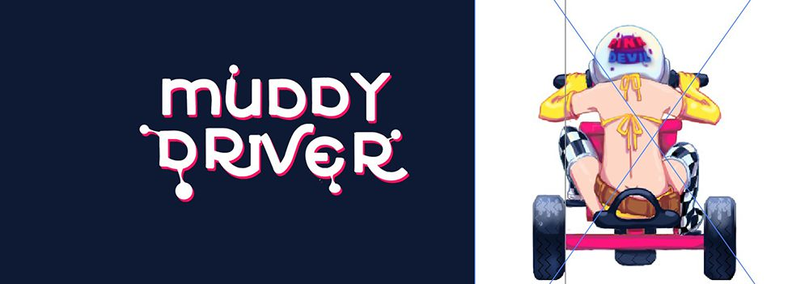
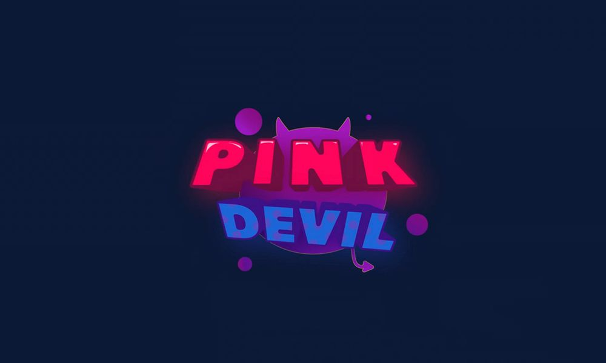
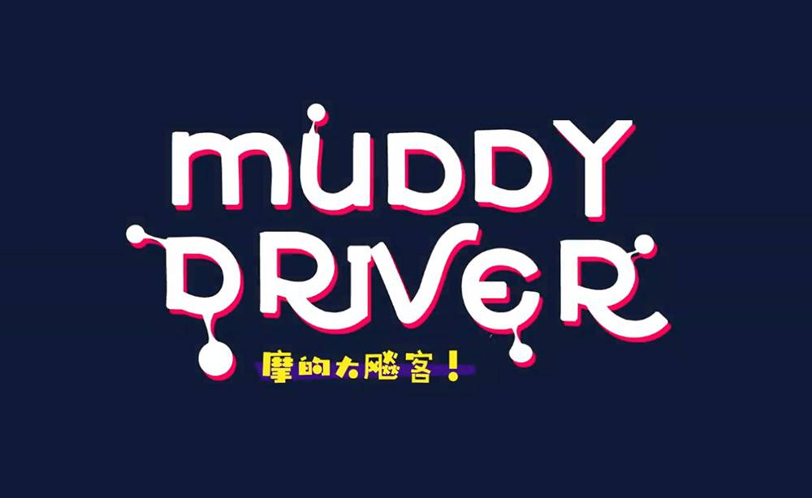
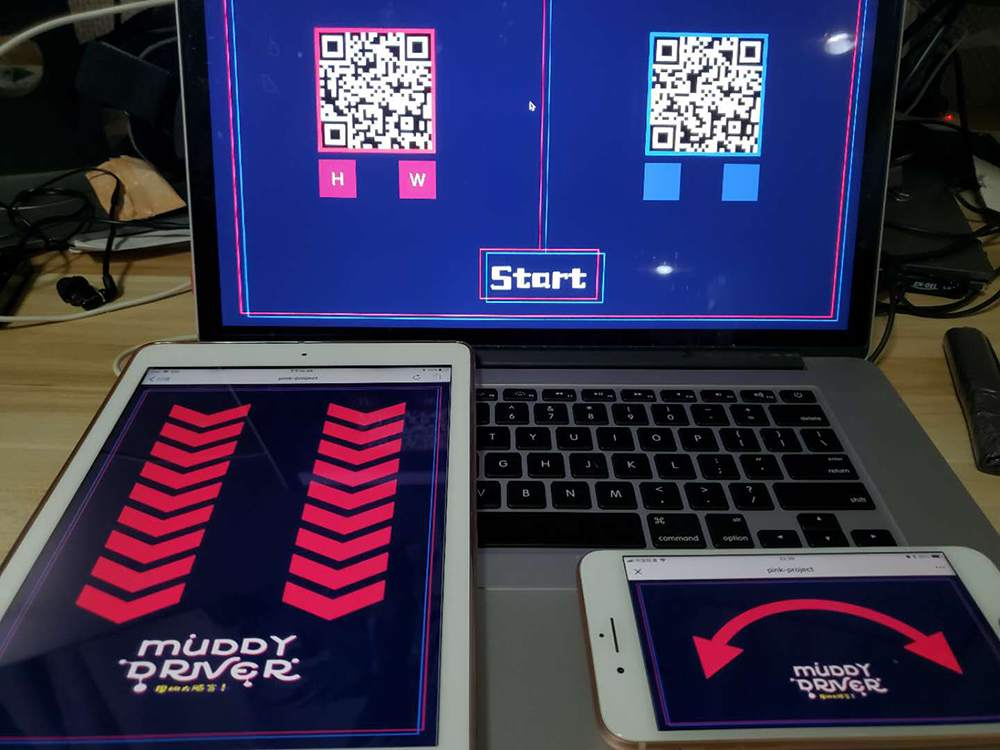
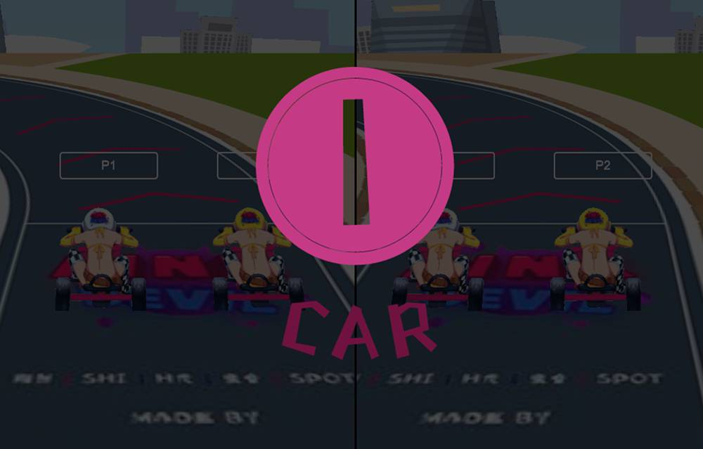
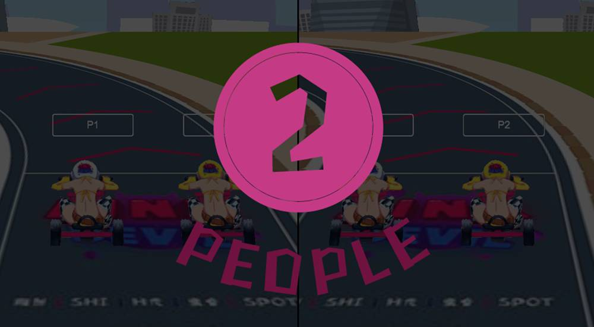
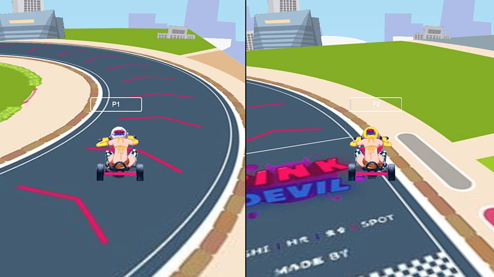

# Muddy Driver (摩的大飚客)

A mad game for GIGA Gamejam 2018.

  

## Require

One PC.  
Four players.  
Four mobiles.  
And good LAN.  

## How to play

Clone code first, then run:  

```shell
npm install
```

Open `client/src/config.ts`, change the `url` to `${your_ip}:4444` and run:  

```
npm run build
npm run server
```

Then open `${your_ip}:4444/view`, you will see the logos:  

  
  

Click it and you will see this:  

  

Use your mobiles to scan the two qrcodes then click `start` to start game, every cycle need two mobiles to control, one for controller orientation (rotate), another for speed(slide):   

  
  
  

The winner is the first one to reach the finish line:  

  

## How to develop

```shell
npm run server
npm run dev
```

Then open `${your_ip}:8888/view`.

## Staff

Programmer:  

[dtysky(H光)](https://github.com/dtysky)  
[greenSnot(虫合)](https://github.com/greenSnot)  

Artist:  

[shishi(诗诗)]()  
[spot]()

Designer:  

[greenSnot(虫合)](https://github.com/greenSnot)  
[陶然]()  
[dtysky(H光)]()  

  
